# AMBIENT.STUDIO

[](https://openai.com/index/introducing-upgrades-to-codex/)
[](https://opensource.org/licenses/MIT)
[](https://github.com/fathriAbanoub/Ambient-Studio/releases)
[](https://nextjs.org/)
[](https://fastapi.tiangolo.com/)
[](https://www.python.org/)
[](https://www.typescriptlang.org/)
[](https://ffmpeg.org/)

> Create ambient soundscapes in your browser. Mix procedurally-generated ambient music or blend up to 8 custom audio tracks with volume, pan, EQ, loop analysis, stochastic variation, and export to WAV or MP4 video — with optional GPU acceleration.

## Built for OpenAI Build Week (Codex + GPT-5.6)

Ambient.Studio is an established project that predates Build
Week. The **Sample Bank / Field Recordings** feature — the sample
event type and RNG-order guarantees in `musicalLogic.ts`, the
fetch/decode/timeout logic in `sampleBank.ts`, and the shared
`scheduleSamplePlayback()` used by both `LiveEngine.ts` and
`renderAmbient.ts` — was designed and implemented with Codex during
the Build Week submission period, using GPT-5.6.

**How it was built:**

1. **Spec-first, not one-shot.** Codex was given hard constraints
   before writing anything: the new logic had to stay pure and
   deterministic like the rest of `musicalLogic.ts` (zero Web Audio
   dependencies), and had to stay structurally isolated from the
   existing manual `Track` upload system rather than reusing it.
2. **Design note before code.** Codex had to commit to answers on
   specific open questions — how to sequence async sample decoding
   against the engine's synchronous, deterministic beat clock, how
   duplicate sample IDs should resolve — and get sign-off before
   implementing anything.
3. **A review pass caught a real concurrency bug.** Duplicate sample
   IDs were resolving based on whichever network fetch happened to
   finish last, not deterministically. Codex fixed it by routing both
   the trigger logic (`playableSampleEntries()`) and the decoder
   (`decodeSampleBank()`) through the same exported function, so the
   two layers can't disagree. The same pass added the 15-second fetch
   timeout and fixed a lifecycle bug where triggered samples kept
   playing past `stop()`/`dispose()`.
4. **Credits ran out before UI integration.** The engine work shipped
   fully tested and reviewed; the Sample Bank controls in
   `ProceduralTrack.tsx`, the `studioStore.ts` wiring (stable IDs,
   caps, blob URL cleanup), and the mid-playback reconciliation in
   `useProceduralEngine.ts` were then built by hand, following the
   patterns Codex's own engine code had already established.

GPT-5.6, via Codex, powered every one of these rounds.

## Table of Contents

- [Built for OpenAI Build Week](#built-for-openai-build-week-codex--gpt-56)
- [Features](#features)
  - [Procedural Ambient Engine](#procedural-ambient-engine)
  - [Manual Track Mixing](#manual-track-mixing)
  - [Loop Analysis & Rendering](#loop-analysis--rendering)
  - [System & UI](#system--ui)
- [Prerequisites](#prerequisites)
- [Installation](#installation)
- [Usage](#usage)
- [Configuration](#configuration)
- [API Reference](#api-reference)
- [Architecture](#architecture)
  - [Procedural Ambient Engine](#procedural-ambient-engine-1)
  - [Rendering Pipeline](#rendering-pipeline)
  - [Full Render Sequence](#full-render-sequence)
  - [Job Lifecycle](#job-lifecycle)
  - [Frontend State](#frontend-state)
- [GPU Acceleration](#gpu-acceleration)
- [Project Structure](#project-structure)
- [Testing](#testing)
- [Roadmap](#roadmap)
- [Contributing](#contributing)
- [License](#license)

---

## Features

### Procedural Ambient Engine

- **Generative Music** — Built-in procedural ambient generator with deterministic synthesis using seeded PRNG (mulberry32). Produces infinite, evolving soundscapes from pure algorithms.
- **Musical Intelligence** — Markov chain melody generation, Euclidean rhythms for drums, harmonic loop progressions (A3 → F#3 → D3 → E3), and scene-based parameter interpolation.
- **Nine Scales/Modes** — Major and minor pentatonic plus the seven diatonic modes (Ionian, Dorian, Phrygian, Lydian, Mixolydian, Aeolian, Locrian), selectable from the Synthesis panel.
- **Three Scenes** — "Calm" (major pentatonic, 72 BPM), "Nocturne" (minor pentatonic, 62 BPM), "Ether" (major pentatonic, 68 BPM, FM timbre) with automatic crossfading.
- **Beatless Drone Mode** — Toggle drums off entirely for a sustained, evolving drone bed; up to 8 drone layers (hz, amp, pan, timbre, optional detune/sweep) addable and editable live.
- **Drum Styles & Swing** — Switch between the default Euclidean pattern and a 4-on-the-floor kick style, with an adjustable swing amount (0–60%) applied to off-beat timing.
- **Sidechain Ducking** — Adjustable sidechain depth ducks the tonal bus against the kick for a pumping, club-adjacent feel.
- **Sample Bank / Field Recordings** _(built with Codex during OpenAI Build Week — [see above](#built-for-openai-build-week-codex--gpt-56))_ — Upload up to 16 of your own audio samples into the sample bank; they're decoded and scheduled alongside the procedural layers, with object URLs safely revoked as entries are removed or replaced.
- **Live Parameter Reconciliation** — Scale, drum style, swing, sidechain, drone layers, and sample bank edits all apply mid-playback — no need to stop and restart the generator to hear a change.
- **Deterministic Rendering** — Offline export via OfflineAudioContext with 4-bar pre-roll and automatic trimming. Same seed + parameters = byte-identical WAV output.
- **Real-time & Export** — LiveEngine for browser playback with precise event scheduling and parameter slewing; renderAmbient for offline WAV export with progress tracking.
- **Configurable Parameters** — Seed, tempo (BPM), complexity (0–1), reverb/delay mix (0–1), drum level (0–1), scale/mode, drum style, swing, sidechain amount, drone layers, sample bank, scene duration, and scene enable/disable.

### Manual Track Mixing

- **Multi-track Audio Mixer** — Browser-based interface with 8 track slots. The backend imposes no hard track limit.
- **Real-time EQ Control** — 7-band equalizer (Sub 60 Hz, Bass 200 Hz, Low-Mid 500 Hz, Mid 1 kHz, Upper-Mid 3 kHz, Presence 8 kHz, Air 16 kHz) with live frequency-response curve.
- **Per-track Controls** — Volume (0.0–1.5), pan (−1.0 to 1.0), mute, solo, color, and microphone input toggle.
- **Live VU Meter** — Real-time level visualizer driven by the Web Audio API analyser node.
- **Waveform Display** — Per-track canvas waveform rendered on file load with DPI scaling.
- **Presets** — Built-in presets (Forest, Ocean, Space, Café) plus save/delete custom presets integrated into the header.

### Loop Analysis & Rendering

- **Loop Analysis** — Pre-render loop point detection via the "Analyze Loop" button. Detects optimal loop start/end with crossfade and seamlessness scoring, displays candidates and alternatives, warns on low-confidence seams (<70%), and feeds the result directly into the export as a manual override. Analysis can be re-run at any time; stale results are cleared automatically.
- **Stochastic Variation** — Per-loop randomization of volume, pan, and EQ micro-shifts via an entropy layer with slow drift — keeps long ambient tracks evolving.
- **WAV Export** — Server-side via the async job system with full loop processing and entropy layer.
- **MP4 Video Export** — Server-side rendering via FFmpeg with three rendering paths:
  - CUDA GPU visualizer (6× faster than FFmpeg)
  - CPU-optimized visualizer (3–4× faster than FFmpeg)
  - FFmpeg `showfreqs` fallback
- **Video Download** — On job completion, a toast notification appears and the browser automatically downloads the MP4 via a Next.js proxy route (`GET /api/download/[jobId]`, e.g. `/api/download/abc123`).
- **Frequency Visualizer** — Bar-style mel-spectrogram overlay on video output (64 bars) with configurable FPS.

### System & UI

- **Unified Design System** — Cohesive single-surface layout with ProceduralTrack card, unified transport control, bottom drawer with tabbed Export/Console panels, and shadcn/ui components (Button, Switch, Progress, Tooltip, Tabs).
- **One-glow-at-a-time** — Visual feedback for active playback source (manual tracks vs. procedural generator) via `activePlaybackSource` state.
- **Job Management** — Queue system with real-time progress tracking, cancellation, and concurrent render limiting (2 slots).
- **Job Cancellation** — Cancel queued or in-progress jobs at any time via `DELETE /job/{job_id}`. Uses cooperative `threading.Event` signalling + subprocess termination for clean shutdown.
- **GPU Encoding** — Auto-detects NVIDIA NVENC for hardware-accelerated H.264 encoding; falls back to libx264.
- **System Monitoring** — View CPU, RAM, disk usage, and render statistics.
- **Responsive Design** — Optimized for various screen sizes with proper DPI scaling for all canvases.

## Prerequisites

| Requirement                 | Version                 | Notes                                                           |
| --------------------------- | ----------------------- | --------------------------------------------------------------- |
| Node.js                     | 20.9.0+                 | Frontend runtime (Next.js 16 requirement)                       |
| Python                      | 3.9+                    | Backend runtime                                                 |
| FFmpeg                      | 6.0+                    | Audio/video processing (`ffmpeg` and `ffprobe` on PATH)         |
| NVIDIA GPU (optional)       | Compute Capability 7.0+ | Required for CUDA visualizer and NVENC encoding                 |
| CUDA Toolkit (optional)     | 12.0+                   | Required for CUDA visualizer                                    |
| OpenCV with CUDA (optional) | 4.8+                    | Custom build needed — see [GPU Acceleration](#gpu-acceleration) |

## Installation

### Quick start (recommended)

```bash
git clone https://github.com/fathriAbanoub/Ambient-Studio.git
cd Ambient-Studio
./start.sh
```

`start.sh` does the manual steps below for you: checks for `python3`/`node`/`ffmpeg`, creates a Python virtualenv at `backend/.venv` and installs `requirements.txt` into it, installs frontend workspace dependencies (`bun install` if `bun` is available, otherwise `npm install`), writes `frontend/.env.local` with `NEXT_PUBLIC_API_URL` if it doesn't already exist, then starts the backend on port 3003 and the frontend on port 3002 together, shutting both down cleanly on Ctrl+C.

### Manual setup

#### 1. Clone the repository

```bash
git clone https://github.com/fathriAbanoub/Ambient-Studio.git
cd Ambient-Studio
```

#### 2. Frontend setup

```bash
cd frontend
npm install
```

#### 3. Backend setup

```bash
cd backend
python3 -m venv .venv
source .venv/bin/activate  # On Windows: .venv\Scripts\activate
python -m pip install -r requirements.txt
```

#### 4. Environment variables

Create `frontend/.env.local` (see [Configuration](#configuration)). The backend reads from environment variables — no `.env` file required.

## Usage

### Starting the frontend

```bash
cd frontend
npm run dev
```

Opens on `http://localhost:3002`.

### Starting the backend

```bash
cd backend
uvicorn main:app --reload --host 0.0.0.0 --port 3003
```

API available at `http://localhost:3003`.

Open `http://localhost:3002` in your browser. You can:

1. **Use the procedural generator** — Click play on the "PROCEDURAL GENERATOR" track (track 0) to start infinite ambient music. Adjust seed, tempo, complexity, reverb mix, and drum level. Pick a scale/mode, switch drum style or dial in swing and sidechain amount, or flip on Beatless for a drone-only texture and add drone layers. Upload your own samples into the sample bank. Toggle scenes for automatic mood changes. Export to WAV with configurable duration.

2. **Mix custom audio files** — Drag audio files onto track cards (tracks 1-8), adjust controls, and export.

> **Accepted audio formats:** WAV, MP3, OGG, FLAC, AAC (max 50 MB per file)
>
> **Rendered files** are saved to `backend/output/` and auto-deleted after 24 hours. Copy files before then.
>
> **Note:** The procedural generator and manual tracks use separate playback systems. Solo on any manual track will dim the generator. Only one source can have the active glow indicator at a time.

### Loop Analysis Workflow

Before exporting, click **Analyze Loop** in the Export panel to detect the optimal loop region in your current mix:

1. Click **Analyze Loop** — the backend runs PyMusicLooper on the first active track and returns loop start, end, crossfade duration, and a confidence score.
2. Review the result — scores ≥ 70% are shown in green; scores below 70% show a warning that the seam may be audible.
3. The detected candidate count and alternative count are displayed. Future versions will allow picking between candidates interactively.
4. Click **Preview Seam** to audition the loop boundary using the Web Audio API.
5. Export — the detected `loop_start`/`loop_end` values are automatically sent to the backend as a manual override, skipping backend re-analysis.

If you skip loop analysis entirely, the backend auto-detects loop points from the mixed audio after rendering.

## Configuration

### Frontend

Create `frontend/.env.local`:

| Variable              | Default                 | Description                                                                         |
| --------------------- | ----------------------- | ----------------------------------------------------------------------------------- |
| `NEXT_PUBLIC_API_URL` | `http://localhost:3003` | Public URL of the FastAPI backend (used by browser-side fetch)                      |
| `BACKEND_API_URL`     | `http://localhost:3003` | Server-only URL used by Next.js API proxy routes (e.g. `GET /api/download/[jobId]`) |

> **Note:** `next.config.ts` sets `typescript: { ignoreBuildErrors: true }`. Resolve type errors before deploying.

### Backend

All settings are in `backend/config.py`. Override with environment variables.

| Variable              | Default                                       | Description                                                         |
| --------------------- | --------------------------------------------- | ------------------------------------------------------------------- |
| `HOST`                | `0.0.0.0`                                     | Server bind address                                                 |
| `PORT`                | `3003`                                        | Server port                                                         |
| `ALLOWED_ORIGINS`     | `http://localhost:3002,http://localhost:3003` | Comma-separated CORS origins                                        |
| `SAMPLE_RATE`         | `44100`                                       | Audio sample rate (Hz)                                              |
| `CHANNELS`            | `2`                                           | Output channels (stereo)                                            |
| `BIT_DEPTH`           | `16`                                          | WAV PCM bit depth                                                   |
| `MAX_DURATION`        | `28800`                                       | Maximum render duration in seconds (8 hours)                        |
| `VIDEO_WIDTH`         | `1920`                                        | Output video width (px)                                             |
| `VIDEO_HEIGHT`        | `1080`                                        | Output video height (px)                                            |
| `VIDEO_FPS`           | `25`                                          | Output video frame rate                                             |
| `VIDEO_CODEC`         | `h264_nvenc`                                  | FFmpeg video codec (`h264_nvenc`, `libx264`, or `auto`)             |
| `AUDIO_CODEC`         | `aac`                                         | FFmpeg audio codec                                                  |
| `FFMPEG_PRESET`       | `veryfast`                                    | libx264 encoding preset                                             |
| `CRF`                 | `23`                                          | Video quality (lower = better, larger file); used by libx264        |
| `NVENC_QP`            | `23`                                          | NVENC quality scale (0 = best, 51 = worst)                          |
| `USE_CUDA_VISUALIZER` | `true`                                        | Use CUDA GPU visualizer when available; falls back to CPU or FFmpeg |
| `AUDIO_DEBUG`         | `true`                                        | Log detailed per-stage audio diagnostics                            |

## API Reference

### Health Check

```http
GET /health
```

Returns `{"status": "ok", "version": "3.0.0"}`.

---

### System Information

```http
GET /system
```

Returns CPU %, RAM used/total/%, output folder size/file count, and renders today.

---

### Job History

```http
GET /jobs
```

Returns the last 10 completed render jobs.

---

### Queue Status

```http
GET /queue
```

Returns `queue_depth`, `active_jobs`, `max_concurrent`, and `queued_jobs` list.

---

### Job Status

```http
GET /job/{job_id}
```

Returns full job dict: id, status, progress, duration, started_at, finished_at, error, output_path, filename, file_size, queue_position, logs, time_info.

---

### Job Progress

```http
GET /job/{job_id}/progress
```

Returns `job_id`, `status`, `progress`, `elapsed_seconds`, `remaining_seconds`, `queue_position`, `error`, `time_info`, `logs`.

---

### Cancel Job

```http
DELETE /job/{job_id}
```

Cancels a queued or processing job. Signals the render thread via `threading.Event`, terminates any active FFmpeg subprocess, and cleans up temporary files. Returns `{"status": "cancelled", "job_id": "..."}`.
Returns 404 if not found, 400 if not cancellable.

### Render Full Pipeline (async)

```http
POST /render-video-full
```

Asynchronous pipeline: audio mix → loop analysis → stochastic rotation → entropy layer → video encode. Returns a `job_id` immediately.

| Parameter          | Type         | Default    | Description                                                                                                    |
| ------------------ | ------------ | ---------- | -------------------------------------------------------------------------------------------------------------- |
| `duration`         | int          | _required_ | Duration in seconds (1–28800)                                                                                  |
| `files`            | UploadFile[] | _required_ | Audio track files                                                                                              |
| `volumes`          | str          | `""`       | Comma-separated floats per track                                                                               |
| `pans`             | str          | `""`       | Comma-separated floats per track                                                                               |
| `muted`            | str          | `""`       | Comma-separated "0"/"1" per track                                                                              |
| `solo`             | str          | `""`       | Comma-separated "0"/"1" per track                                                                              |
| `master_gain`      | float        | `1.0`      | Master gain multiplier                                                                                         |
| `eq_gains`         | str          | `""`       | Comma-separated EQ band gains in dB (7 bands)                                                                  |
| `background_image` | UploadFile   | `None`     | Optional custom background image                                                                               |
| `show_visualizer`  | str          | `"0"`      | `"0"` or `"1"` — show frequency spectrum overlay                                                               |
| `use_gpu_encoding` | str          | `"1"`      | `"0"` or `"1"` — use NVENC if available                                                                        |
| `loop_start`       | float        | `None`     | Manual loop start in seconds — skips backend auto-analysis when provided with `loop_end`                       |
| `loop_end`         | float        | `None`     | Manual loop end in seconds — must be greater than `loop_start` and within track bounds; returns 422 if invalid |

Returns: `{"status": "queued", "job_id": "...", "queue_position": N}`.
Poll `GET /job/{job_id}/progress` for status. Download via `GET /download/{job_id}` (backend direct) or `GET /api/download/[jobId]` (frontend proxy, e.g. `/api/download/abc123`).

---

### Render Audio Job (async)

```http
POST /render-audio-job
```

Asynchronous audio-only pipeline: mix → loop analysis → stochastic rotation → entropy layer. Returns a `job_id` immediately.

| Parameter     | Type         | Default    | Description                                   |
| ------------- | ------------ | ---------- | --------------------------------------------- |
| `duration`    | int          | _required_ | Duration in seconds (1–28800)                 |
| `files`       | UploadFile[] | _required_ | Audio track files                             |
| `volumes`     | str          | `""`       | Comma-separated floats per track              |
| `pans`        | str          | `""`       | Comma-separated floats per track              |
| `muted`       | str          | `""`       | Comma-separated "0"/"1" per track             |
| `solo`        | str          | `""`       | Comma-separated "0"/"1" per track             |
| `master_gain` | float        | `1.0`      | Master gain multiplier                        |
| `eq_gains`    | str          | `""`       | Comma-separated EQ band gains in dB (7 bands) |
| `loop_start`  | float        | `None`     | Manual loop start in seconds                  |
| `loop_end`    | float        | `None`     | Manual loop end in seconds                    |

Returns: `{"status": "queued", "job_id": "...", "queue_position": N}`.

---

### Analyze Loop

```http
POST /analyze-loop
```

Analyzes a single audio file for optimal loop points using PyMusicLooper. Returns the best candidate plus scored alternatives. Called by the frontend "Analyze Loop" button before export.

| Parameter | Type       | Default    | Description                                 |
| --------- | ---------- | ---------- | ------------------------------------------- |
| `file`    | UploadFile | _required_ | Audio file to analyze (WAV, MP3, OGG, FLAC) |

Returns:

```json
{
  "loop_start_ms": 4200,
  "loop_end_ms": 32800,
  "score": 0.91,
  "crossfade_ms": 120,
  "duration_ms": 28600,
  "raw_analyzer_score": 0.87,
  "candidates": [
    {
      "segment_id": "...",
      "loop_start_ms": 4200,
      "loop_end_ms": 32800,
      "crossfade_duration_ms": 120,
      "validator_score": 0.91,
      "repetition_salience_score": 0.78
    }
  ],
  "alternatives": [ ... ]
}
```

Scores below 0.70 indicate the loop seam may be audible. The frontend displays a warning in this case.

---

### Download Job Output

```http
GET /download/{job_id}
```

Downloads the completed output file (WAV or MP4) for a finished job. Output filenames include the `job_id` to prevent collisions between concurrent renders.

Returns: `FileResponse`. Returns 404 if job/file not found, 400 if not completed.

> **Frontend proxy:** The Next.js frontend accesses this via `GET /api/download/[jobId]` (e.g. `/api/download/abc123`), which proxies the request server-side using `BACKEND_API_URL`. The `job_id` is sanitized and URL-encoded before proxying. On job completion, the frontend automatically triggers the download via an anchor click and shows a toast notification.

## Architecture

### Procedural Ambient Engine

The procedural engine uses a three-layer architecture for deterministic, reproducible ambient music generation:

#### 1. Pure Musical Logic (`musicalLogic.ts`)

- **Zero dependencies** on Web Audio API or browser globals — the pure procedural decision engine is fully Node.js compatible, while the `OfflineAudioContext` rendering shell remains browser-only.
- **Deterministic PRNG** — mulberry32 seeded random number generator replaces `Math.random()`
- **Musical decision engine** — `getMusicalEvents(beat, state, params) → { events, nextState }`
  - Markov chain melody generation with complexity-based interval weighting
  - Euclidean rhythm distribution for kick, snare, hi-hat patterns, or a 4-on-the-floor kick when `drumStyle: "fourFloor"`
  - Harmonic loop progression: A3 (220Hz) → F#3 (185Hz) → D3 (147Hz) → E3 (165Hz)
  - Scene interpolation across Calm/Nocturne/Ether with automatic crossfading
  - Nine scales/modes — major/minor pentatonic plus the seven diatonic modes (Ionian, Dorian, Phrygian, Lydian, Mixolydian, Aeolian, Locrian) — with octave-shifted bass/pad/melody voices
  - Drone layers (up to 8) with a one-shot latch in beatless mode (`enableBeats: false`) so drones fire once per layer instead of retriggering every beat
  - Sample bank entries validated via `playableSampleEntries()` and scheduled alongside procedural events
- **Event types** — melody, pad, bass, bell, kick, snare, hihat, drone with hz, amp, duration, pan, timbre
- **Sub-beat timing** — Drum events use `subBeatIndex` (0–3) for sixteenth-note precision
- **RNG order guarantee** — Matches original engine.ts constructor + tick() call sequence exactly, including the sample-lane RNG draw when a valid sample bank entry is present
- **Scheduling helpers (`scheduling.ts`)** — Pure, shell-shared helpers for swing (`getSubBeatEventTime`, offsetting odd sub-beats by up to 60% of a sixteenth note) and sidechain ducking (`getSidechainDuckShape`, returning duck depth/attack/release for the tonal bus around each kick)
- **Sample decoding (`sampleBank.ts`)** — Fetches and decodes uploaded sample URLs into `AudioBuffer`s (15s timeout per sample, per-sample failure isolation) for the live/offline shells to schedule

#### 2. Real-time Synthesis Shell (`LiveEngine.ts`)

- **Web Audio API graph** — OscillatorNode + GainNode + BiquadFilterNode topology
- **Precise event scheduling** — Uses `AudioContext.currentTime` + lookahead buffer, with swing and sidechain applied via `scheduling.ts`
- **Parameter slewing** — 600ms linear ramps for harmonic root changes
- **Scene crossfading** — Smooth BPM, complexity, mix, density, timbre transitions
- **Noise buffer** — 0.5s pink noise generated once, shared across drum voices
- **Start/stop lifecycle** — Clean node creation/disposal, deterministic state reset, including the beatless drone latch
- **Mid-playback reconciliation** — `useProceduralEngine` diffs incoming drone config and sample bank IDs against the previous render each tick; on a change it calls `engine.resyncDroneLayers()` and/or `engine.reloadSampleBank()` so edits while the generator is already playing take effect without a stop/start cycle

#### 3. Offline Rendering Shell (`renderAmbient.ts`)

- **Browser-only shell** — Uses the browser's `OfflineAudioContext` for deterministic offline rendering with progress callbacks (unlike the pure logic layer, this requires a browser environment).
- **4-bar pre-roll** — Ensures attack envelopes are fully realized before export starts
- **Automatic pre-roll trimming** — Extracts target duration from offset sample
- **WAV export** — 16-bit PCM, 44.1kHz stereo, compatible with backend pipeline
- **Progress tracking** — Renders in chunks with `RenderProgress` callbacks for UI updates
- **Same seed = same output** — Byte-identical WAV files across multiple renders

**Key invariant:** Both LiveEngine and renderAmbient call the same `getMusicalEvents()` function from musicalLogic.ts, ensuring live playback and exported audio are musically identical (modulo pre-roll trimming).

### Rendering Pipeline

The full render pipeline (`POST /render-video-full`) processes jobs through these stages:

1. **Audio Mix** — Mixes all tracks with volume, pan, and 7-band EQ via `pedalboard`
2. **Loop Analysis** — Uses manual `loop_start`/`loop_end` override if provided by the frontend pre-render analysis; otherwise auto-detects from the mixed audio using PyMusicLooper
3. **Seamless Extension** — Extends short audio to target duration using crossfaded loops
4. **Stochastic Rotation** — Applies per-loop randomization of volume/pan/EQ micro-shifts via `StochasticVariationScheduler`
5. **Entropy Layer** — Adds slow drift (volume, pan, EQ) across the full duration for evolving texture
6. **Video Encode** — Combines background image + audio + optional visualizer into MP4

### Job Lifecycle

```text
queued → processing → completed / failed / cancelled
```

- **Concurrency** — Semaphore limits to 2 concurrent render slots. Jobs check the stop signal before acquiring a slot and between each render stage.
- **Cancellation** — Cooperative `threading.Event` (stop_events map, separate from the job dict to keep it JSON-serializable) + asyncio task cancellation + FFmpeg subprocess termination. The subprocess is registered before `communicate()` is awaited so cancellation can reach it immediately.
- **Progress** — Real-time progress percentage with elapsed/remaining time estimates
- **Persistence** — Last 100 jobs saved to `jobs_history.json`
- **Cleanup** — Temp directories are cleaned on job completion, cancellation, or pre-job validation failure. Output filenames include the `job_id` to prevent collisions.

### Full Render Sequence

> This diagram covers the **manual-track backend pipeline** (`/render-audio-job`, `/render-video-full`) — file uploads, loop analysis, and the job-queue-based WAV/MP4 export. The **procedural generator's** WAV export is a separate, entirely client-side path: `renderAmbient()` renders through `OfflineAudioContext` in the browser and `renderAndDownloadWav()` triggers the download directly — it never touches the backend or the job system described below.

```mermaid
sequenceDiagram
    autonumber
    participant User
    participant Frontend
    participant Backend_API as Backend API
    participant JobManager
    participant AudioRenderer
    participant LoopAnalyzer
    participant LoopProcessor
    participant VariationScheduler
    participant EntropyLayer
    participant Renderer as Renderer (3-tier)
    participant FileSystem

    User->>Frontend: Upload audio tracks
    Frontend->>Frontend: decodeAudioData per track<br/>store AudioBuffer in zustand
    Frontend->>Frontend: initAudioEngine()<br/>AnalyserNode + 7-band EQ + masterGain

    opt User clicks "Analyze Loop" before export
        Frontend->>Backend_API: POST /analyze-loop<br/>(first non-muted track file)
        Backend_API->>LoopAnalyzer: analyze_loop(file)<br/>PyMusicLooper + validate +<br/>repetition_salience
        LoopAnalyzer-->>Backend_API: {loop_start_ms, loop_end_ms,<br/>score, crossfade_ms, duration_ms,<br/>raw_analyzer_score,<br/>candidates[], alternatives[]}
        Backend_API-->>Frontend: LoopAnalysisResult
        Frontend->>Frontend: Display score + warning if score < 0.70<br/>Show candidate + alternative counts<br/>Store loopStartMs / loopEndMs for export
        Note over Frontend: User may click "Preview Seam"<br/>to audition via useAudioEngine
    end

    User->>Frontend: Submit export<br/>(showVisualizer, useGpuEncoding)

    alt Audio-only export
        Frontend->>Backend_API: POST /render-audio-job<br/>(files, duration, volumes, pans,<br/>muted, solo, master_gain, eq_gains,<br/>loop_start?, loop_end?)
    else Video export
        Frontend->>Backend_API: POST /render-video-full<br/>(files, duration, volumes, pans,<br/>muted, solo, master_gain, eq_gains,<br/>loop_start?, loop_end?,<br/>show_visualizer, use_gpu_encoding,<br/>background_image?)
    end

    Note over Backend_API: Validate manual loop bounds (422 on invalid).<br/>Create temp directory. Create job only after<br/>file I/O and parsing succeed.

    Backend_API->>JobManager: create_job(duration)
    JobManager-->>Backend_API: job_id
    Backend_API-->>Frontend: {status: "queued", job_id, queue_position}

    Backend_API->>JobManager: start_job(job_id)
    Note over Backend_API: Check stop_event before acquiring render semaphore
    Backend_API->>AudioRenderer: render_async(track_paths, ...)<br/>Single-pass FFmpeg: loop input,<br/>volume, pan, amix, master_gain, EQ
    AudioRenderer-->>Backend_API: Mixed WAV
    Backend_API->>JobManager: update_progress(10-35%)

    alt loop_start/loop_end not provided by frontend
        Note over Backend_API: Check stop_event before heavy analysis
        Backend_API->>LoopAnalyzer: analyze_loop(mixed_audio)
        LoopAnalyzer->>LoopAnalyzer: PyMusicLooper + validate +<br/>repetition_salience
        LoopAnalyzer-->>Backend_API: {loop_start_ms, loop_end_ms,<br/>score, crossfade_ms, duration_ms,<br/>candidates[], alternatives[]}
        Backend_API->>JobManager: update_progress(40%)
    else loop_start/loop_end provided (frontend pre-analysis override)
        Note over Backend_API: Skip auto-analysis, use provided values directly
    end

    Backend_API->>LoopProcessor: make_loop() → canonical unit
    LoopProcessor->>FileSystem: Write canonical loop WAV
    Backend_API->>LoopProcessor: extend_loop_seamless()<br/>or assemble_with_rotation()
    LoopProcessor->>FileSystem: Write extended loop WAV
    LoopProcessor-->>Backend_API: Extended loop path
    Backend_API->>JobManager: update_progress(48%)

    Backend_API->>VariationScheduler: schedule(segments, target_duration)<br/>StochasticVariationScheduler:<br/>max_consecutive=2, salience_budget=0.55
    VariationScheduler->>VariationScheduler: Stratify by salience,<br/>filter repeats, weighted choice,<br/>temporal jitter 0.60-1.00
    VariationScheduler-->>Backend_API: AssemblyPlan{segments,<br/>transitions, total_duration}

    Backend_API->>EntropyLayer: process(audio, params)<br/>gain_drift (pink noise ±1.5dB),<br/>stereo_drift (anti-correlated ±0.06),<br/>hf_drift (above 4kHz ±1.25dB),<br/>then Limiter(-1dB)
    Backend_API->>JobManager: update_progress(50%)

    alt Video export with visualizer
        Backend_API->>Renderer: render_async(audio, bg, output)
        alt CUDA available
            Renderer->>Renderer: CudaVisualizerRenderer<br/>librosa mel-spectro 64 bars,<br/>GPU bg zoom + CPU bar draw,<br/>FFmpeg NVENC pipe
        else CPU fallback
            Renderer->>Renderer: CPUVisualizerRenderer<br/>PIL/NumPy mel-spectro 64 bars,<br/>FFmpeg libx264 pipe
        else No optimized viz
            Renderer->>Renderer: FFmpeg showfreqs filter<br/>+ hwupload_cuda overlay
        end
        Renderer->>FileSystem: Write MP4 (filename includes job_id)
        Renderer-->>Backend_API: Video complete
    else Audio-only export
        Note over Backend_API: Skip video rendering
        FileSystem->>FileSystem: Write WAV (filename includes job_id)
    end

    Backend_API->>JobManager: complete_job(job_id,<br/>output_path, filename, file_size)
    Backend_API->>FileSystem: Clean up temp directory

    Frontend->>Frontend: Poll GET /job/{job_id}/progress every 2s<br/>(via ref to avoid stale closure)
    Backend_API->>JobManager: get_job_progress(job_id)
    JobManager-->>Backend_API: {status, progress, elapsed,<br/>remaining, queue_position, logs[]}
    Backend_API-->>Frontend: Progress + logs
    Frontend->>Frontend: Append incremental logs,<br/>update progress bar

    alt Job completed — Audio export
        Frontend->>Backend_API: GET /download/{job_id}
        Backend_API->>FileSystem: Read WAV output
        Backend_API-->>Frontend: FileResponse (WAV)
        Frontend->>User: Auto-download WAV via downloadBlob()
    else Job completed — Video export
        Frontend->>Frontend: Show toast "Render finished — download starting…"
        Frontend->>Frontend: Trigger anchor click → GET /api/download/[jobId]
        Frontend->>Backend_API: GET /download/{job_id}<br/>(via Next.js proxy /api/download/[jobId],<br/>job_id sanitized + URL-encoded)
        Backend_API->>FileSystem: Read MP4 output
        Backend_API-->>Frontend: FileResponse (MP4)
        Frontend->>User: Browser downloads MP4
    end
```



### Frontend State

Single-page app with Zustand store (`studioStore.ts`) managing tracks, playback, EQ, export state, presets, loop analysis, procedural generator parameters, and backend health. The `useAudioEngine` hook bridges Web Audio API to React for manual tracks. The `useProceduralEngine` hook manages the procedural generator's LiveEngine and offline rendering.

**Loop analysis state** is cleared before each new analysis run and on failure, ensuring stale results from a previous track are never sent to the export endpoints.

**Job polling** uses a `ref`-based interval (not state) to eliminate stale closure bugs where the polling callback captured an outdated job ID or status.

**Active playback source** (`activePlaybackSource`: `"manual" | "generator" | null`) ensures only one playback system has the visual glow indicator at a time, preventing UI confusion.

## GPU Acceleration

### Rendering Paths (ordered by speed)

| Path                       | Speed                    | Requirements                                   |
| -------------------------- | ------------------------ | ---------------------------------------------- |
| CUDA visualizer + NVENC    | ~6× faster than FFmpeg   | NVIDIA GPU, CUDA 12.0+, OpenCV built with CUDA |
| CPU visualizer + NVENC     | ~3–4× faster than FFmpeg | NVIDIA GPU (NVENC only)                        |
| FFmpeg showfreqs + NVENC   | Baseline                 | NVIDIA GPU (NVENC only)                        |
| FFmpeg showfreqs + libx264 | Slowest                  | CPU only                                       |

Auto-detection runs at startup: the backend probes `cv2.cuda.getCudaEnabledDeviceCount()` and `ffmpeg h264_nvenc` to select the best available path.

### Building OpenCV with CUDA

A build script is provided at `backend/build_opencv_cuda.sh` for OpenCV 4.8.0 with CUDA 12.0, targeting compute capability 7.5 (GTX 1650 Ti). Adjust `CUDA_ARCH_BIN` for your GPU.

```bash
cd backend
chmod +x build_opencv_cuda.sh
./build_opencv_cuda.sh   # Takes 20–30 minutes
pip uninstall opencv-contrib-python opencv-python  # Remove pip version
```

After building, set the CUDA library path:

```bash
source backend/set_cuda_env.sh
```

## Project Structure

```text
ambient-studio/
├── start.sh                          # One-command startup: creates backend venv, installs
│                                      # frontend+backend deps, writes .env.local, runs both
├── config.json                       # Project configuration (ports, workspaces, steering rules)
├── frontend/                         # Next.js 16 frontend (React 19, TypeScript)
│   ├── src/
│   │   ├── app/                      # Next.js App Router
│   │   │   ├── page.tsx              # Single-page studio app
│   │   │   ├── layout.tsx            # Root layout (fonts, providers)
│   │   │   ├── globals.css           # Tailwind + custom styles + range inputs
│   │   │   └── api/
│   │   │       ├── route.ts          # Default Next.js stub route (unused)
│   │   │       └── download/[jobId]/ # Video/audio download proxy route
│   │   ├── components/
│   │   │   ├── studio/               # Core UI components
│   │   │   │   ├── TrackCard.tsx         # Track mixer card (volume, pan, mute, solo)
│   │   │   │   ├── ProceduralTrack.tsx   # Procedural generator card (track 0), incl.
│   │   │   │   │                         # scale/drum-style/swing/sidechain/drone/sample-bank UI
│   │   │   │   ├── Transport.tsx         # Unified circular play/stop, master volume, timer
│   │   │   │   ├── EQPanel.tsx           # 7-band EQ with frequency response canvas
│   │   │   │   ├── ExportPanel.tsx       # Export dialog: loop analysis, job progress, download
│   │   │   │   ├── VideoPreview.tsx      # Video preview canvas
│   │   │   │   ├── Header.tsx            # Top bar with backend health + preset controls
│   │   │   │   ├── BottomDrawer.tsx      # Tabbed drawer (Export/Console panels)
│   │   │   │   └── LogConsole.tsx        # Timestamped render event log
│   │   │   └── ui/                   # shadcn/ui primitives (button, progress, slider,
│   │   │                             # switch, tabs, toast, toaster, tooltip)
│   │   ├── hooks/
│   │   │   ├── useAudioEngine.ts     # Web Audio API bridge (playback, analyser, seam preview)
│   │   │   ├── useProceduralEngine.ts # Procedural generator bridge: LiveEngine lifecycle,
│   │   │   │                         # mid-playback drone/sample-bank reconciliation, export
│   │   │   ├── use-mobile.ts         # Responsive breakpoint hook
│   │   │   └── use-toast.ts          # Toast notification hook
│   │   ├── store/
│   │   │   └── studioStore.ts        # Zustand store (tracks, EQ, presets, export, generator
│   │   │                             # incl. stable drone/sample IDs, caps, blob URL cleanup)
│   │   ├── types/
│   │   │   └── index.ts              # Shared TypeScript types and constants
│   │   ├── lib/
│   │   │   ├── api.ts                # Backend API client (analyzeLoop, renderJob, download)
│   │   │   ├── audioContext.ts       # Shared/singleton browser AudioContext accessor
│   │   │   ├── audioRenderer.ts      # Client-side OfflineAudioContext renderer
│   │   │   ├── ambient-engine/       # Procedural ambient music engine
│   │   │   │   ├── index.ts          # Public API exports
│   │   │   │   ├── musicalLogic.ts   # Pure decision engine (Markov, Euclidean, scenes,
│   │   │   │   │                     # modes, drone, samples) — 8 describe blocks / 30 tests
│   │   │   │   ├── musicalLogic.test.ts # Vitest suite for musicalLogic.ts
│   │   │   │   ├── scheduling.ts     # Shell-shared swing/sidechain timing helpers
│   │   │   │   ├── sampleBank.ts     # Sample bank fetch/decode for live/offline shells
│   │   │   │   ├── sampleBank.test.ts # Vitest suite for sampleBank.ts (1 describe / 4 tests)
│   │   │   │   ├── LiveEngine.ts     # Real-time Web Audio synthesis shell
│   │   │   │   └── renderAmbient.ts  # Offline OfflineAudioContext renderer
│   │   │   └── utils.ts              # Tailwind utility (cn)
│   │   ├── public/                   # Static assets
│   │   └── package.json
│   ├── tests/                        # Playwright e2e suite (65 tests across 3 spec files)
│   │   ├── playback-and-tracks.spec.ts   # Playback, track mixing, procedural generator params
│   │   ├── export-and-jobs.spec.ts       # Loop analysis, export, job polling/download
│   │   ├── ui-and-global-state.spec.ts   # Presets, header, drawer, global UI state
│   │   ├── helpers/                      # base-test.ts fixture + mocks.ts route mocking
│   │   └── fixtures/                     # dummy-1sec.wav test fixture
│   └── vitest.config.ts              # Vitest configuration (unit tests for ambient-engine)
├── backend/                          # FastAPI backend (Python 3.9+)
│   ├── main.py                       # App entry: endpoints, JobManager, job lifecycle
│   ├── config.py                     # Settings class (all env var overrides)
│   ├── requirements.txt              # Python dependencies (includes pymusiclooper==3.6.0)
│   ├── services/
│   │   ├── audio_renderer.py         # Multi-track mixing with pedalboard EQ
│   │   ├── video_renderer.py         # FFmpeg-based video encoding (NVENC/libx264)
│   │   ├── visualizer_base.py        # Shared visualizer infrastructure (CPU + CUDA)
│   │   ├── cuda_visualizer.py        # GPU-accelerated mel-spectrogram visualizer (OpenCV CUDA)
│   │   ├── cpu_visualizer.py         # CPU-optimized mel-spectrogram visualizer (3–4× faster)
│   │   ├── loop_processor.py         # Loop creation, seamless extension, rotation assembly
│   │   ├── loop_analyzer.py          # Automatic loop point detection (PyMusicLooper)
│   │   ├── variation_scheduler.py    # Stochastic per-loop variation scheduling
│   │   ├── entropy_layer.py          # Slow-drift volume/pan/EQ across full duration
│   │   ├── audio_debug.py            # Per-stage audio diagnostics logger
│   │   └── visualizer_generator.py   # Visualizer frame generation utilities
│   ├── assets/                       # Default background image
│   ├── output/                       # Rendered MP4/WAV files (auto-cleaned after 24h)
│   ├── tmp/                          # Temporary render work files
│   ├── logs/                         # Structured render logs (rotating 10 MB)
│   ├── build_opencv_cuda.sh          # OpenCV CUDA build script
│   ├── set_cuda_env.sh               # CUDA library path setup
│   ├── diagnose_cuda.py              # Manual diagnostic: CUDA/OpenCV environment report
│   ├── verify_cuda_env.py            # Manual diagnostic: verifies CUDA env vars/paths
│   ├── test_cuda.py                  # Manual script: checks OpenCV CUDA visualizer deps
│   └── test_loop_pipeline.py         # Manual script: exercises loop_analyzer/loop_processor
│                                      # against a real input file (not part of an automated suite)
└── LICENSE                           # MIT License
```

## Testing

### Frontend unit tests (Vitest)

```bash
cd frontend
npm test          # run once
npm run test:watch # watch mode
```

Covers the `ambient-engine` pure logic layer: 30 tests in `musicalLogic.test.ts` across 8 `describe` blocks (determinism, sample-bank/soundscape lane, scale intervals, beatless mode, drum styles, swing/sidechain no-op isolation, scene pack lookup, scene progress agreement) plus 4 tests in `sampleBank.test.ts`.

### Frontend end-to-end tests (Playwright)

```bash
cd frontend
npm run test:e2e     # headless
npm run test:e2e:ui  # interactive UI mode
```

65 tests across three spec files: `playback-and-tracks.spec.ts` (playback, track mixing, procedural generator parameters), `export-and-jobs.spec.ts` (loop analysis, export flow, job polling/download), and `ui-and-global-state.spec.ts` (presets, header, drawer, global UI state). Shared fixtures and route mocks live in `tests/helpers/`.

### Backend diagnostics

The backend has no automated pytest suite. Instead, a few standalone scripts under `backend/` are run manually to verify an environment before relying on GPU rendering or the loop pipeline:

```bash
cd backend
python3 test_cuda.py          # checks OpenCV/CUDA visualizer dependencies are importable
python3 diagnose_cuda.py      # reports on the CUDA/OpenCV environment
python3 verify_cuda_env.py    # verifies CUDA env vars and library paths are set correctly
python3 test_loop_pipeline.py <input_file>  # exercises loop_analyzer + loop_processor end to end
```

## Roadmap

- [ ] Procedural engine backend integration (server-side rendering with same deterministic algorithm)
- [ ] MCP server exposing `musicalLogic.ts` as a tool surface — blocked on deciding the Node.js execution path for the pure-logic layer (it's OfflineAudioContext-adjacent code that currently only runs in the browser; needs a Node-compatible offline render path before it can be wrapped as an MCP server)
- [ ] Procedural engine parameter automation curves (tempo ramps, complexity arcs)
- [ ] Procedural engine MIDI export
- [ ] Berlin-school step sequencer mode for the procedural engine (classic arpeggiated sequencer pattern, distinct from the current Markov/Euclidean generation)
- [ ] Atonal scale/mode option (alongside the current 9 pentatonic/diatonic scales)
- [ ] Noise bed layer (continuous filtered-noise texture layer, separate from the existing drum noise buffer)
- [ ] Convolution reverb (impulse-response based, replacing/supplementing the current delay-based mix control)
- [ ] Interactive loop candidate picker (choose between detected alternatives before export)
- [ ] Client-side mixdown for loop analysis (analyze the blended mix, not just the first track)
- [ ] Waveform canvas with draggable loop point markers
- [ ] Expose EntropyLayer params as user controls (gain drift, stereo drift, HF drift sliders)
- [ ] Expose VariationScheduler params (max consecutive, salience budget, temporal jitter)
- [ ] Mood/evolution curve over time (tension arc presets: Flat, Build, Arc)
- [ ] 30-second preview render for fast parameter iteration
- [ ] Additional video animation options (zoom, particle effects)
- [ ] User authentication and project saving
- [ ] Expand preset library
- [ ] Drag-and-drop track reordering
- [ ] Server-Sent Events (SSE) for real-time progress instead of polling

## Contributing

1. Fork the repository.
2. Create a feature branch (`git checkout -b feature/your-feature`).
3. Make your changes.
4. Run tests and ensure code quality.
5. Commit (`git commit -m 'feat: Add new feature'`).
6. Push (`git push origin feature/your-feature`).
7. Open a Pull Request.

## License

MIT License — see [LICENSE](./LICENSE) for details.
