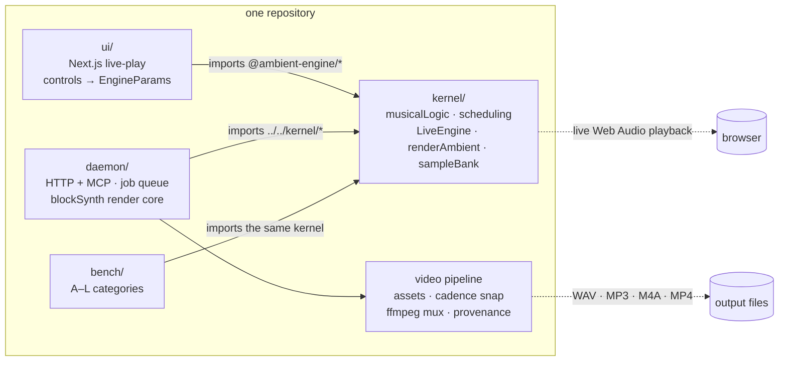

<div align="center">

# AMBIENT.STUDIO

**One deterministic generative-ambient kernel — live in your browser, rendered to hour-long audio/video by a daemon, and benchmarked to prove it.**

    

[Overview] • [Getting Started](#getting-started) • [Usage](#usage) • [Testing](#testing) • [Benchmarks](#benchmarks) • [Known Limitations](#known-limitations)

</div>

Ambient Studio is a single repository with three runnable parts that all share one copy of the same TypeScript synthesis kernel: a Next.js live-play UI (real-time Web Audio), a headless render daemon with an HTTP API + MCP surface (long-form WAV/MP3/M4A/MP4 output with stock-video muxing), and a benchmark suite that measures all of it with a hard no-fabricated-numbers policy. There is no server-side mixer backend and no duplicated kernel copy — the daemon and the UI import the very same `kernel/` files, so render output and live playback cannot drift apart by construction.

## Getting started

The three commands this repo exists for:

```bash
npm install                     # once, at the repo root (npm workspaces)

npm run ui                      # 1 — live-play UI on http://localhost:3002
npm run daemon                  # 2 — render daemon on http://127.0.0.1:7781
npm run bench                   # 3 — benchmark suite (categories A–L)
```

> [!TIP]
> Add `-- --categories G,H,I,J,K,L` to `npm run bench` for the in-process synth categories (A–F run by default), and `-- --scale 0.2` for a quick smoke pass. Full flag reference [below](#benchmark-suite).

> [!IMPORTANT]
> Every render path enforces a strict determinism contract: fixed event order, fixed voice summation order, a single seeded PRNG (the daemon generates and persists a seed via CSPRNG when a recipe omits one — never `Math.random()` at render time), in-process automation state carried across render blocks, and loud failure on malformed input. If you touch any code on a render path, re-run the test suite — it checks these invariants, not just "does it run".

## Overview

- **One shared kernel** (`kernel/`) — pure musical logic (`musicalLogic.ts`), timing/scheduling helpers, browser synthesis shells (`LiveEngine.ts`, `renderAmbient.ts`), and a sample bank. Zero Web-Audio dependencies in the core, fully deterministic given a seed.
- **Live-play UI** (`ui/`) — Next.js 16 + Web Audio. Every kernel parameter has a control (see [the audit table](#parameter-surface)), including root frequency, harmonic-loop toggle, per-drone-layer detune/sweep, and per-sample gain/pan. Client-side offline WAV export via `OfflineAudioContext`.
- **Render daemon** (`daemon/`) — job queue with per-job worker isolation, asset registry with Pexels/Pixabay ingest + normalization, cadence-snapped durations, streaming PCM-to-ffmpeg pipes for MP3/M4A/MP4, decoded-content output verification, and full provenance sidecars. MCP shim auto-spawns the daemon on cold start.
- **Benchmark suite** (`bench/`) — 12 categories (A–L) covering kernel throughput, offline render, ffmpeg encode ladders, disk accounting, worker isolation, automation state-carry, and determinism stress. Every number carries its environment stamp; missing tools *skip* with the exact install command, they never fail silently or get estimated.


```mermaid
graph LR
    subgraph repo["one repository"]
        K["kernel/<br/>musicalLogic · scheduling<br/>LiveEngine · renderAmbient · sampleBank"]
        UI["ui/<br/>Next.js live-play<br/>controls → EngineParams"]
        D["daemon/<br/>HTTP + MCP · job queue<br/>blockSynth render core"]
        V["video pipeline<br/>assets · cadence snap<br/>ffmpeg mux · provenance"]
        B["bench/<br/>A–L categories"]
    end
    UI -- "imports @ambient-engine/*" --> K
    D -- "imports ../../kernel/*" --> K
    D --> V
    B -- "imports the same kernel" --> K
    K -.->|"live Web Audio playback"| U[("browser")]
    V -.->|"WAV · MP3 · M4A · MP4"| O[("output files")]
```

### Repository layout

```text
.
├── package.json            # npm workspaces: ui · daemon · bench
├── kernel/                 # THE shared kernel — one copy, three importers
│   ├── musicalLogic.ts     # pure deterministic music generation
│   ├── scheduling.ts       # swing / sidechain / sub-beat timing helpers
│   ├── LiveEngine.ts       # real-time browser playback
│   ├── renderAmbient.ts    # offline WAV export (OfflineAudioContext)
│   ├── sampleBank.ts       # sample decode + scheduling
│   └── *.test.ts           # kernel unit tests (vitest)
├── ui/                     # live-play UI (Next.js, port 3002)
│   └── src/
│       ├── app/            # page shell
│       ├── components/     # ProceduralTrack (the generator control surface)
│       ├── hooks/          # useProceduralEngine (LiveEngine lifecycle)
│       ├── lib/            # recipe.ts — the one GeneratorState → EngineParams builder
│       └── store/          # zustand store
├── daemon/                 # ambientd — render daemon (port 7781)
│   ├── src/                # server · mcp · jobs · blockSynth · sinks · assets · video
│   ├── scripts/            # build · typecheck · shared-kernel drift guard
│   └── test/               # 125-check suite incl. round-2 signal-path regressions
└── bench/                  # benchmark suite (see bench/README.md)
    ├── A/ … L_corrected_reruns/
    ├── lib/                # env capture, result schema, stats, tsrun, ffmpeg helpers
    ├── results/            # runs from THIS machine (regenerated per run)
    ├── results-user-hardware/  # archived capture from a different machine — never rewritten
    └── README.md           # full benchmark methodology
```

## Usage

### 1 — Live-play UI

```bash
npm run ui        # → http://localhost:3002
```

Open the procedural track's advanced panel, dial in the generator, press PLAY. EXPORT WAV renders the exact same `EngineParams` through `renderAmbient.ts` client-side.

### 2 — Render daemon

```bash
npm run daemon                    # build + start on 127.0.0.1:7781
AMBIENTD_PORT=8080 npm run daemon # override port / data dir via AMBIENTD_DATA
node daemon/build/mcp.cjs         # stdio MCP shim — auto-spawns the daemon if it isn't running
```

HTTP API (mirrored 1:1 by the 10 MCP tools):

| Route | Purpose |
| --- | --- |
| `POST /recipes` | create recipe (CSPRNG seed generated + persisted if omitted) |
| `GET /recipes/:id` | fetch |
| `POST /jobs` | submit (returns 202; `{duration_sec, preview_format}` overrides allowed) |
| `GET /jobs/:id` | status + progress |
| `GET /jobs/:id/result` | output files + provenance sidecar |
| `POST /assets/search` | Pexels/Pixabay shortlist (thumbnails, duration, license) |
| `POST /assets/select` | download + normalize + cache a candidate (or direct URL) |
| `POST /assets/upload` | same ingest for a local file |
| `GET /assets` · `DELETE /assets/:id` | registry introspection / eviction |

| MCP tool | Mirrors |
| --- | --- |
| `create_recipe` | `POST /recipes` |
| `submit_job` | `POST /jobs` |
| `job_status` / `job_result` | `GET /jobs/:id` / `GET /jobs/:id/result` |
| `render_preview` | short MP3 preview of a recipe |
| `search_stock_videos` / `select_stock_video` | `POST /assets/search` / `POST /assets/select` |
| `upload_custom_video` / `list_assets` / `evict_asset` | `POST /assets/upload` / `GET /assets` / `DELETE /assets/:id` |

Env: `AMBIENTD_PORT` (7781) · `AMBIENTD_DATA` (./data) · `PEXELS_API_KEY` / `PIXABAY_API_KEY` (stock search; loud error without them).

> [!NOTE]
> Recipes are the same `EngineParams` type the UI builds — defined once in `kernel/musicalLogic.ts` and imported by both sides, with a compile-time drift guard between the MCP schema and the kernel type.

### 3 — Benchmark suite

```bash
npm run bench                              # categories A–F (defaults)
npm run bench -- --categories G,H,I,J,K,L  # in-process synth categories
npm run bench -- --categories D --scale 0.2
npm run bench -- --full                    # widen D's fps sweep
npm run bench -- --long-2h                 # one 2-hour case per category (opt-in)
```

| Flag | Effect |
| --- | --- |
| `--categories A,…` | subset of categories (A–F default; G–L opt-in) |
| `--scale S` | divides every sweep duration by `1/S` — smoke passes |
| `--trials N` | trials per point (default 1) |
| `--long-2h` / `--long-8h` | opt into the long cases (plan hours) |
| `--full` | widen D's fps sweep (5/10/15/24) |
| `--keep-artifacts` | keep WAV/MP4 outputs instead of deleting |
| `--no-aggregate` | skip the summary.md re-render |

Every result lands in `bench/results/` as schema-stamped JSON (environment + methodology + raw samples + assertions). Summary tables are rendered from the stored `stats.median` of each trial. Full methodology: [bench/README.md](bench/README.md).

## Parameter surface

Audited field-by-field against `kernel/musicalLogic.ts` (`EngineParams`, `DroneLayerParams`, `SampleBankEntry`), not against the old UI. The audit added controls for everything previously reachable only by hand-editing a recipe:

| Parameter | Where it lives | UI control (before → after) |
| --- | --- | --- |
| `scale` | `EngineParams` | select, all 9 scales (already exposed) |
| `rootHz` | `EngineParams` | **none → number input** (was hardcoded 220) |
| `bpm` / `complexity` / `mix` / `drumLevel` | `EngineParams` | sliders (already exposed) |
| `sceneDurationBars` / `enableScenes` / `enableBeats` | `EngineParams` | select / switches (already exposed) |
| `enableHarmonicLoop` | `EngineParams` | **none → switch** (was hardcoded `true`) |
| `swing` / `sidechainAmount` | `EngineParams` | sliders (already exposed) |
| `drumStyle` | `EngineParams` | select — **both** `euclideanTrap` and `fourFloor` selectable |
| `seed` | `EngineParams` | number input (already exposed) |
| `scenePack` | `EngineParams` | no control — the kernel ships exactly one pack (`"default"`, `musicalLogic.ts:81`); add one when a second exists |
| `drone[].detuneCents` | `DroneLayerParams` | **none → number input** |
| `drone[].sweepSec` | `DroneLayerParams` | **none → number input** |
| `drone[].hz` / `amp` / `pan` / `timbre` | `DroneLayerParams` | inputs / sliders / select (already exposed) |
| `sampleBank[].gain` | `SampleBankEntry` | **none → number input** (was hardcoded 1) |
| `sampleBank[].pan` | `SampleBankEntry` | **none → slider** |

Round-trip guarantees: `src/lib/recipe.ts` is the single `GeneratorState → EngineParams` builder (unit-tested against every field via the real store), and a Playwright spec drives the actual DOM controls and asserts the values on the **running** `LiveEngine` instance.

## Testing

```bash
npm test          # all three suites, in order
```

| Suite | Command | What it proves |
| --- | --- | --- |
| Kernel + recipe | `npm run test -w ui` | 49 vitest tests: kernel unit tests + parameter round-trip through the real store |
| Daemon | `npm run test -w daemon` | 125 checks: shared-kernel single-copy guard, strict typecheck, smoke (determinism + D1–D5), phase 2–7 (assets, cadence/MP3, mux, daemon isolation, MCP cold-start E2E), round-2 signal-path regressions |
| Bench harness | `npm run test -w bench` | selftest of the suite's own libs |

The round-2 regression block is behavioral, not cosmetic: BiquadFilterNode Q-in-dB verified against real `getFrequencyResponse` fixtures, the +128-render-quantum feedback-delay tap, frozen FM depth/sweep at layer start, ffmpeg stdin backpressure (stress-tested until `drain` waits actually fire), and decoded-content finalize verification that **rejects deliberately truncated files**.

## Benchmarks

Two sources, captured on **different hardware** — they are not comparable number-to-number and are only each used to sanity-check the other's shape (flat-vs-not RSS curves, roughly-consistent realtime multipliers).

### Results on the author's hardware

Captured on an Intel i5-10300H (4 cores, 15.5 GB RAM, node v22.21.0, ffmpeg 6.1.1). Kept verbatim in [`bench/results-user-hardware/`](bench/results-user-hardware/) with its own `summary.md` and environment stamps — presented as-is:

- **D — ffmpeg ladder** (scale 0.2): static @1fps 24-min output in 39.4 s; zoompan 6-min@5fps in 251.5 s; loop-mux mp4 6-min in ~100 s class; assembly-with-stream-copy beats naive re-encode.
- **G — in-process streaming synth** (scale 1): 240-min render at ~30× realtime with peak RSS ~75–113 MB (curve flat vs 1.3 GB of PCM16); block sizes 1024–16384 byte-identical; determinism hashes stable across runs.
- **H/I/J/K/L** — event-loop lag during worker render ≈ baseline (median ratio 0.86); automation state-carry healthy-partition hashes equal; WAV→ffmpeg vs stdin pipe roughly time-neutral; summation-order determinism: fixed-order variants 1/7 distinct hashes, completion-order variant 7/7; corrected kernel sweep confirms the original sequential-sweep contamination.

Full tables: [`bench/results-user-hardware/summary.md`](bench/results-user-hardware/summary.md).

### Results from this repo's consolidation run

Captured on a 2-vCPU Intel Xeon sandbox (3.9 GB RAM, node v24.21.0, ffmpeg 7.1.5) during the unification task; full tables with per-file environment stamps in [`bench/results/summary.md`](bench/results/summary.md):

- **A — kernel throughput**: 8-hour horizon simulated; median 0.87 µs per `getMusicalEvents` call; the 8h totals land in A3.
- **B — offline render** (scale 0.02, browser + node variants): wall time scales with duration in both engines; browser OfflineAudioContext is the ground-truth environment.
- **D — ffmpeg ladder** (D1 at scale 0.2; D2–D4 at scale 0.1): static @1fps 24-min in 43.9 s; zoompan 3-min@10fps in 131 s; loop-mux 3-min@10fps in 31.8 s; D4 assembly vs naive consistent with the author capture's shape.
- **G — streaming synth** (scale 0.35): 240-scaled-min render at 36.8× realtime, peak RSS 180 MB vs 2.5 GB PCM16 — slope ≈ 0.35 MB/audio-minute (3.5% of the PCM rate); zero non-finite samples; determinism hashes identical across fresh processes.
- **H/I/J/K/L** — worker render leaves the main thread responsive (median lag ratio 0.86); automation state-carry healthy; stdin pipe avoids the 0.71 GB intermediate (60-min case); fixed summation order 1/7 distinct hashes vs 7/7 for completion-order (the controlled experiment reproduces); corrected kernel sweep isolates per-config in fresh processes.

Run the suite on your own machine to get your own numbers — that is the entire point of the harness.

## Known limitations

> [!WARNING]
> **Beatless drone mode is a one-shot latch, not a continuous generator.** With `enableBeats: false`, the kernel emits drone events exactly once — on the first beatless beat — then latches (`musicalLogic.ts:638-644`: `if (!s.droneLayersStarted) { …; s.droneLayersStarted = true; }`; the flag is declared at `:204` and only reset by a start/`startState`-clone at `:671`). A "5-minute ambient drone" in this mode is therefore the frozen first-second sustain with no further musical movement, regardless of any parameter tuning. This is a deliberate architectural characteristic of the music-generation design, not a bug introduced by packaging — changing it is an explicit design decision that has deliberately **not** been made here. Beat-enabled mode re-fires drones every beat and is unaffected.
